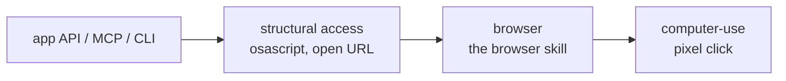

[Русский](README.md) · English

# computer-use — the macOS desktop with token-spend discipline

Claude drives native macOS apps (Finder, Notes, Calendar, Maps, System Settings, any software without an API) through the computer-use MCP server **built into** Claude Code.

## Why

The server already ships with Claude Code — the plugin does not install it. The plugin adds the discipline without which computer-use burns context: a screenshot costs ~1000–1800 tokens, and the frame history is re-sent on every iteration (18 frames ≈ 279K tokens).

The skill says when a frame is genuinely needed and what replaces it, how to batch chains of actions, and why a pixel click is the last rung of the ladder rather than the opening move.

On top of that it carries a growing set of app recipes: System Settings deep links, channels for extracting a result, chat-app pitfalls.

## What it looks like



The surface hierarchy: before pixels, check APIs, `osascript` and URL schemes, then the browser. Screen control is reserved for what nothing else can reach — native UI without an API, simulators, GUI-only tools (tag `computer-use--v1.1.1`).

## Install

The plugin installs together with its neighbour — commands are in the [root README](../../README.en.md). On its own:

```bash
claude plugin marketplace add https://github.com/beCyborg/jadlis-plugins.git
claude plugin install computer-use@jadlis
```

Then enable the server, once per project:

1. Run `/mcp` in a Claude Code session.
2. Find `computer-use` in the list → **Enable**.
3. On first use macOS asks for two permissions — grant both: **Accessibility** (clicks, typing, scrolling) and **Screen Recording** (screenshots).

The server is missing from the `/mcp` list — check the requirements: macOS and a Pro or Max plan. A black frame instead of the screen means Screen Recording was not granted.

## Usage

Plain text, naming the app or the screen:

```
take a screenshot of the desktop and tell me which apps are open
in Notes create a note with the shopping list
walk through the settings and turn on Do Not Disturb
```

- **Check.** "take a screenshot of the desktop" → Claude requests access (`request_access`), captures a frame and describes the screen.
- **Access is requested in one call** for the whole route: one dialog per list of apps, splitting it means extra interruptions. A refusal means stop and report, with no workarounds.
- **Long tasks** are cut by the skill into subtasks with a check after each, and it warns you: the screen will be busy, the emergency stop is Esc.

## Limits and cost

- **Nothing to pay beyond the subscription,** but a **Pro or Max** plan is required: computer-use is a research preview and is unavailable on Team and Enterprise.
- **macOS only, and interactive sessions only.** The server does not work headless (`claude -p`).
- **Not for this:** the web and logged-in sites → the **browser** plugin (DOM-aware, cheaper than pixels); Electron apps (Slack, Obsidian, VS Code, Discord) → their own MCP or CLI; the terminal → Bash; project files → Read/Write/Edit. If an app has its own MCP or CLI, go there.
- **Your real privileges.** The desktop runs under your account; the skill requires explicit confirmation before irreversible actions. That is a rule in the prompt, not a technical block.
- **The failure mode is the long chain.** Success compounds across steps: if 2–3 loop iterations have not advanced the task, the skill stops and asks instead of hammering the screen.

## Update

```bash
claude plugin update computer-use@jadlis
```

Auto-update for third-party marketplaces is off by default on the recipient's side — enable it once in `/plugin` → **Marketplaces**. Version history — [CHANGELOG.md](CHANGELOG.md).
