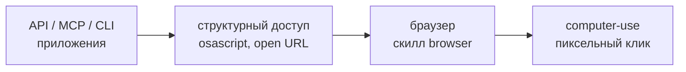

Русский · [English](README.en.md)

# computer-use — рабочий стол macOS с дисциплиной расхода токенов

Claude управляет native-приложениями macOS (Finder, Заметки, Календарь, Карты, Системные настройки, любой софт без API) через **встроенный** в Claude Code MCP-сервер `computer-use`.

## Зачем

Сам сервер уже входит в Claude Code — плагин его не ставит. Плагин добавляет дисциплину, без которой computer-use сжигает контекст: скриншот стоит ~1000–1800 токенов, а история кадров пере-отправляется на каждой итерации (18 кадров ≈ 279K токенов).

Скилл говорит, когда кадр действительно нужен и чем его заменить, как батчить цепочки действий и почему пиксельный клик — последняя ступень лестницы, а не первый ход.

Плюс накопитель рецептов под конкретные приложения: deep-links Системных настроек, каналы извлечения результата, ловушки чат-приложений.

## Как выглядит



Иерархия поверхностей: до пикселей проверяются API, `osascript` и URL-схемы, затем браузер. Screen control зарезервирован за тем, до чего ничем другим не дотянуться — нативный UI без API, симуляторы, GUI-only инструменты (тег `computer-use--v1.1.1`).

## Как поставить

Плагин ставится вместе с соседним — команды в [корневом README](../../README.md). Отдельно:

```bash
claude plugin marketplace add https://github.com/beCyborg/jadlis-plugins.git
claude plugin install computer-use@jadlis
```

Дальше включение сервера — один раз на проект:

1. В сессии Claude Code выполни `/mcp`.
2. Найди в списке `computer-use` → **Enable**.
3. При первом использовании macOS попросит два разрешения — выдай оба: **Accessibility** (клики, ввод, прокрутка) и **Screen Recording** (скриншоты).

Сервера нет в списке `/mcp` — сверь требования: macOS и план Pro или Max. Чёрный кадр вместо экрана = не выдано Screen Recording.

## Как пользоваться

Обычным текстом, с указанием приложения или экрана:

```
сделай скриншот рабочего стола и скажи, какие приложения открыты
в Заметках создай заметку со списком покупок
пройди по настройкам и включи «Не беспокоить»
```

- **Проверка.** «сделай скриншот рабочего стола» → Claude запросит доступ (`request_access`), снимет кадр и опишет экран.
- **Доступ запрашивается одним вызовом** на весь маршрут: диалог один на список приложений, дробить = лишние прерывания. Отказ → стоп и доклад, без обходов.
- **Долгие задачи** скилл режет на подзадачи с проверкой после каждой и предупреждает: экран будет занят, аварийный стоп — Esc.

## Границы и стоимость

- **Оплаты сверх подписки нет,** но нужен план **Pro или Max**: computer-use — research preview, на Team и Enterprise недоступен.
- **Только macOS и только интерактивная сессия.** В headless-режиме (`claude -p`) сервер не работает.
- **Не сюда:** веб и залогиненные сайты → плагин **browser** (DOM-aware, дешевле пикселей); Electron-приложения (Slack, Obsidian, VS Code, Discord) → их MCP или CLI; терминал → Bash; файлы проекта → Read/Write/Edit. Есть свой MCP или CLI у приложения — идти туда.
- **Твои реальные привилегии.** Рабочий стол работает под твоей учёткой; скилл требует явного подтверждения перед необратимыми действиями. Это правило в промпте, а не техническая блокировка.
- **Режим отказа — длинная цепочка.** Успех компаундируется по шагам: если 2–3 итерации петли не продвинули задачу, скилл останавливается и спрашивает, а не долбит экран дальше.

## Обновление

```bash
claude plugin update computer-use@jadlis
```

Авто-обновление сторонних маркетплейсов у получателя выключено по умолчанию — включается один раз в `/plugin` → **Marketplaces**. История версий — [CHANGELOG.md](CHANGELOG.md).
