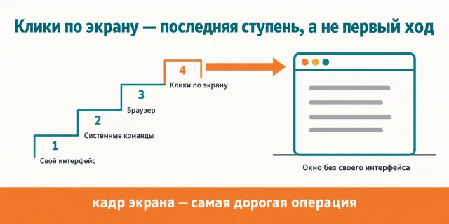
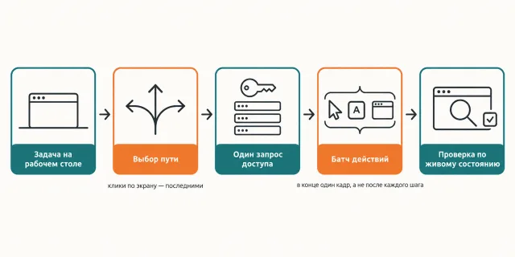

Русский · [English](README.en.md)

# Часть работы живёт в окне приложения, у которого нет ни API, ни командной строки

`jadlis-computer-use` не ставит сервер управления экраном — он уже встроен в Claude Code, — а
добавляет к нему дисциплину: чем заменить кадр экрана, что собирать в один батч и почему
пиксельный клик стоит в очереди последним, а не первым.

```
claude plugin marketplace add https://github.com/beCyborg/jadlis-hub
claude plugin install jadlis-computer-use@jadlis
```

Ключей не нужно, но сам сервер `computer-use` включается один раз командой `/mcp` и требует
плана Pro или Max.



Текстом: слева лестница способов — свой интерфейс приложения, системные команды, браузер и только
наверху клики по экрану, — справа нативное окно, до которого ничем другим не дотянуться.

Это моё рабочее место, выложенное как есть, а не продукт: чем перестал пользоваться — убрал.

## Было → стало

| Руками | Чатом с ИИ | Этим плагином |
|---|---|---|
| **Как задача попадает в приложение без API.** Кликаешь сам, окно за окном. | Объясняет, куда нажать, а нажимаешь всё равно ты. | Агент ведёт нативное окно сам — но только после того, как проверил более дешёвые пути: свой интерфейс приложения, системные команды и URL-схемы, браузер. |
| **Сколько стоит посмотреть на экран.** Смотришь глазами, платить не за что. | Снимаешь кадр сам и прикладываешь его к сообщению. | Кадр снимается не на каждый шаг: результат забирается текстом — кнопкой «Копировать» или сохранением в файл, — а предсказуемая цепочка уходит одним батчем с хвостовым кадром в конце. |
| **Как выдаётся доступ к приложениям.** Вопроса нет: это твой компьютер. | — | Маршрут планируется целиком, и доступ запрашивается одним диалогом на весь список приложений; отказ — стоп и доклад, без обходных путей. |
| **Что считается «готово».** Видишь результат на экране. | Отвечает «должно работать». | Готово проверяется по живому состоянию: файл появился, вывод команды есть, финальный кадр показывает конечный экран. Отсутствие ошибки успехом не считается. |
| **Когда цепочка перестала идти.** Бросаешь и делаешь руками. | — | Две-три итерации без продвижения — стоп и вопрос, а не новый круг кликов; разобранное приложение дописывается рецептом в `references/app-recipes.md` и в следующий раз стоит дёшево. |

## Как это работает



На входе — задача в нативном окне и твоё разрешение: диалог доступа подтверждаешь ты, не агент.
Внутри — сначала более дешёвые поверхности, потом действия батчем и текстовые каналы вместо кадров.
На выходе — сохранённый результат, проверенный по живому состоянию, а не самоотчёт «готово».

Текстом: задача на рабочем столе → выбор пути → один запрос доступа → батч действий → проверка
по живому состоянию.

Иерархия поверхностей одна и та же для любой задачи: свой API, MCP или CLI приложения →
структурный доступ через `osascript` и `open` с URL-схемой → браузер → и только потом клики по
экрану. Электронные приложения — Slack, Obsidian, VS Code, Discord — это браузер в обёртке, им
дорога в их же MCP или CLI, а не в пиксели.

Скриншот — самая дорогая операция контура: кадр уходит в контекст картинкой и остаётся в истории,
которая пере-отправляется на каждой итерации. Поэтому скилл называет цель до кадра, снимает кадр
после открытия приложения, навигации и перед необратимым действием — и заменяет его текстом там,
где это возможно: буфер обмена, сохранение в файл, зум региона уже снятого кадра.

Механические цепочки идут одним вызовом `computer_batch`: действия исполняются подряд, стоп на
первой ошибке, координаты внутри батча отсчитываются от пред-батчевого кадра, а хвостовой
скриншот проверяет итог и становится базой координат для следующего вызова. Разведку и разбор
ошибок скилл не батчит.

Диагностика вынесена отдельно, потому что её симптомы обманчивы: пустой или чёрный кадр — это
сбой захвата, а не «приложение не запущено»; права привязаны к тому приложению, из которого
запущен Claude Code, и оно должно стартовать уже после выдачи прав; часть системных меню рисуется
слоем вне захвата, и её не берёт никакая точность прицела — только клавиатура.

## Установка и первый запуск

**а) Текст для вставки агенту.** Скопируй целиком в чат Claude Code:

```
Ты — установщик. Поставь на этот Mac плагин jadlis-computer-use из маркетплейса jadlis.
Ключей этому плагину не нужно, ничего секретного спрашивать не надо.
Выполни ровно эти команды, дословно, ничего не сокращая:
1. claude plugin marketplace add https://github.com/beCyborg/jadlis-hub
2. claude plugin install jadlis-computer-use@jadlis
3. claude plugin list — покажи мне строку про jadlis-computer-use и его версию.
Потом скажи мне одной строкой: выполнить /mcp, включить сервер computer-use
и перезапустить Claude Code.
Перед каждой командой покажи её мне целиком и дождись «да». Сказал «нет» — не выполняй,
скажи, что именно пропустил, и иди дальше.
Команда вернула ошибку — остановись, покажи вывод, к следующей не переходи.
```

**б) Команды руками.**

```
claude plugin marketplace add https://github.com/beCyborg/jadlis-hub
claude plugin install jadlis-computer-use@jadlis
claude plugin list
```

Первая команда ничего не ставит — она добавляет маркетплейс. Ставит только вторая, и снимается
она одной строкой: `claude plugin uninstall jadlis-computer-use@jadlis --keep-data`.

**в) Короткая команда.** Открой Claude Code и набери:

```
/computer-use
```

Не находится — сверь имя строкой `claude plugin list`. Скилл поднимается и на обычной фразе:
«сделай скриншот рабочего стола и скажи, какие приложения открыты».

**Включение сервера — один раз на проект.** Выполни `/mcp`, найди в списке `computer-use` и
включи его. При первом использовании macOS попросит два разрешения: Универсальный доступ (клики,
ввод, прокрутка) и Запись экрана (кадры) — нужны оба. Сервера нет в списке — сверь требования:
macOS, интерактивная сессия, план Pro или Max.

## Границы, стоимость, обновление

**Чего не делает.** Не работает нигде, кроме macOS, и только в интерактивной сессии: в headless
(`claude -p`) сервера нет. Не ставит сервер сам — он встроенный, плагин добавляет только скилл.
Не ходит в веб и на залогиненные сайты: это соседний плагин `jadlis-browser`, он дешевле пикселей.
Не лезет в Electron-приложения пикселями, пока у них есть свой MCP или CLI. Не обходит твой отказ
в диалоге доступа скриптовым путём. Не считает отсутствие ошибки успехом и не докладывает «готово»
без сохранённого результата. Не держит две сессии сразу: машинный лок один, и он живёт до конца
сессии, а не до конца задачи.

**Что нужно.** Ключей и подписок на сторонние сервисы не нужно. Нужен план Claude **Pro или Max**:
управление экраном — research preview, на Team и Enterprise его нет. Нужны macOS и два разрешения
в Системных настройках — Универсальный доступ и Запись экрана, — выданные тому приложению, из
которого запущен Claude Code; после выдачи приложение перезапускается, иначе права не подхватятся.
Для долгих задач полезен режим «Не беспокоить»: всплывший баннер уведомления забирает клик себе.

**Порядок расхода токенов.** Прогон тяжелее обычного текстового: каждый кадр экрана идёт в контекст
картинкой и остаётся в истории, а история пере-отправляется на каждой итерации петли. Поэтому
дисциплина скилла — не про аккуратность, а про счёт: текстовый канал вместо кадра, батч вместо
россыпи вызовов, один кадр в конце вместо кадра после каждого шага.

**Проверено там, где я работаю:** мой Mac, моя подписка. Только macOS — вне её сервера просто нет.
На бета-версиях macOS якоря системных диалогов и deep-links расходятся с рецептами: это отмечено
в самом скилле, расхождения дописываются в `references/app-recipes.md` по месту.

**Условия использования.** Лицензии нет: все права сохранены за автором. Читать и
пользоваться лично можно. Коммерческое использование, переиздание и включение в свои
продукты — по договорённости со мной.

**Обновление.** У стороннего маркетплейса авто-обновление на твоей стороне выключено: пока не
запустишь первую команду, у тебя остаётся та версия, которую ты поставил.

```
claude plugin marketplace update jadlis
claude plugin update jadlis-computer-use@jadlis
claude plugin list
```

Переустановка, если что-то встало криво:

```
claude plugin uninstall jadlis-computer-use@jadlis --keep-data && claude plugin install jadlis-computer-use@jadlis
```

История версий — [CHANGELOG.md](CHANGELOG.md).
